# Zigbee CSS PHY Transmitter


A complete, end-to-end implementation of the **IEEE 802.15.4a Chirp Spread Spectrum (CSS) PHY transmitter**: a bit-true MATLAB golden model, synthesizable Verilog RTL, stage-by-stage testbenches driven by MATLAB test vectors, FPGA implementation flows for **Intel Quartus** and **AMD Vivado**, and a full **Synopsys ASIC flow** (synthesis → place & route → formal equivalence) on the SAED 90 nm educational library.

The transmitter turns a payload of up to 127 bytes into a stream of complex **DQCSK** (differential quadrature chirp-shift keying) samples, `Tx_real` / `Tx_imag`, at either of the two standard CSS data rates.

---

## Table of Contents

1. [Overview](#1-overview)
2. [Architecture](#2-architecture)
3. [Top-Level Interface](#3-top-level-interface)
4. [RTL Modules](#4-rtl-modules)
5. [MATLAB Golden Model](#5-matlab-golden-model)
6. [Verification](#6-verification)
7. [FPGA Flows](#7-fpga-flows)
8. [ASIC Flow](#8-asic-flow)
9. [Key Results](#9-key-results)
10. [Repository Structure](#10-repository-structure)
11. [Tools](#11-tools)
12. [Getting Started](#12-getting-started)
13. [Known Limitations and Notes](#13-known-limitations-and-notes)
14. [References and License](#14-references-and-license)

---

## 1. Overview

CSS is the PHY defined in the IEEE 802.15.4a amendment for low-rate wireless personal area networks. Information is carried by chirps: each symbol is a sequence of four sub-chirps whose waveforms are selected by chirp-shift keying, and whose phases carry differentially encoded QPSK data.

### Key features

- **Two data rates**, selected at run time with a single `data_rate` pin
  - **1 Mbps**: 3-bit data symbols → 4-chip bi-orthogonal codewords (code rate 3/4), 8-symbol preamble
  - **250 kbps**: 6-bit data symbols → 32-chip bi-orthogonal codewords (code rate 3/16), 20-symbol preamble, bit interleaving
- **Complete transmit chain in RTL**: PHR/PSDU framing, zero padding, I/Q demultiplexing, codeword mapping, interleaving, preamble + SFD insertion, QPSK mapping, DQPSK encoding, CSK sub-chirp generation and DQPSK-to-DQCSK modulation
- **Multiplier-free datapath**: the DQPSK encoder and the DQCSK modulator only swap, negate and add, since every DQPSK symbol is a unit-axis rotation
- **On-chip payload RAM** with a simple write port (127 × 8 bit)
- **MATLAB golden model** that dumps every intermediate stage to text files for cycle-by-cycle RTL comparison
- **Three implementation flows** from the same RTL: Quartus, Vivado (Nexys board wrapper) and a scripted Synopsys ASIC flow

### Specification summary

| Parameter | 1 Mbps (`data_rate = 0`) | 250 kbps (`data_rate = 1`) |
|---|---|---|
| Bits per data symbol (per I / Q path) | 3 | 6 |
| Codeword length | 4 chips | 32 chips |
| Preamble | 8 chirp symbols (32 chips of `1`) | 20 chirp symbols (80 chips of `1`) |
| SFD | 16 chips | 16 chips |
| Zero-padding block | 6 bits | 24 bits |
| Bit interleaver | bypassed | across 2 consecutive codewords (I and Q independently) |
| PHR | 12 bits (7-bit length, 2 unused, 3 reserved) | same |
| Sub-chirp length | 38 samples | 38 samples |
| Sub-chirps per chirp symbol | 4 | 4 |
| DQPSK memory | 4 symbols, initialised to `1 + j` | same |
| Output | `Tx_real`, `Tx_imag`: signed 8-bit | same |
| Maximum payload | 127 bytes | see [Known Limitations](#13-known-limitations-and-notes) |

---

## 2. Architecture


The same pipeline, as a diagram that renders directly on GitHub:

```mermaid
flowchart LR
    HOST["Host / testbench<br/>payload write port<br/>start_Tx, data_rate, payloadLength"] --> C

    subgraph FE["Bit-domain front end (1 bit per clock)"]
        direction LR
        C["controller<br/>+ payload RAM"] --> ZP["zero_padding"]
        ZP --> DM["demux_iq"]
        DM --> SM["symbol_mapper"]
        SM --> IL["bit_interleaver"]
        IL --> PP["form_ppdu<br/>preamble + SFD + payload"]
    end

    subgraph SY["Symbol domain"]
        direction LR
        QM["qpsk_mapper"] --> DQ["dqpsk_encoder"]
        DQ --> BUF["DQPSK capture buffer<br/>1024 x 2-bit I and Q"]
    end

    subgraph CH["Chirp domain (38 samples per sub-chirp)"]
        direction LR
        SEQ["csk_sequencer"] --> SEL["csk_waveform_selector"]
        SEL --> ROM["csk_waveform_rom<br/>4 waveforms x 38 samples"]
        ROM --> MUL["dqpsk_csk_multiplier"]
    end

    PP --> QM
    BUF -- "one symbol per sub-chirp" --> MUL
    BUF -- "frame captured: start" --> SEQ
    MUL --> OUT["Tx_real / Tx_imag<br/>signed 8-bit"]
```



### 2.1 Stage-by-stage data path

| # | Stage | Function |
|---|---|---|
| 1 | **controller** | Stores the payload in RAM, computes frame sizes, and serialises `PHR + payload` one bit per clock. Tracks the frame until the last QPSK symbol has been produced. |
| 2 | **zero_padding** | Appends zeros so the stream fills whole symbol-mapper / interleaver blocks (6 bits at 1 Mbps, 24 bits at 250 kbps). |
| 3 | **demux_iq** | Alternates bits onto the I and Q paths (first bit → I, second bit → Q, and so on). |
| 4 | **symbol_mapper** | Collects 3 (or 6) bits per path and looks up the 4-chip (or 32-chip) bi-orthogonal codeword in a ROM. |
| 5 | **bit_interleaver** | 250 kbps only: permutes the chips of two consecutive 32-chip codewords into one 64-chip block, independently for I and Q. |
| 6 | **form_ppdu** | Emits preamble, then SFD, then the buffered codeword chips as a serial I/Q chip stream. Preamble and SFD are applied to both I and Q. |
| 7 | **qpsk_mapper** | Maps each (I, Q) chip pair to a QPSK symbol: `11 → 1`, `10 → -j`, `01 → +j`, `00 → -1`. |
| 8 | **dqpsk_encoder** | Differentially encodes with a 4-symbol feedback memory (symbol *n* is combined with the output of symbol *n − 4*). |
| 9 | **DQPSK capture buffer** | Stores the complete DQPSK symbol stream so it can be replayed at the much slower chirp sample rate. |
| 10 | **csk_sequencer / selector / ROM** | Steps through 4 sub-chirps × 38 samples per group, inserts the inter-group gaps, and reads the base waveform chosen by chirp-sequence index `m`. |
| 11 | **dqpsk_csk_multiplier** | Rotates each sub-chirp sample by the held DQPSK symbol: `(s_re + j·s_im) · (i_c + j·q_c)`, implemented with sign-select and add. |

### 2.2 Clock and rate domains

The design uses **one clock**, but three very different data rates flow through it:

- The **front end** produces roughly one bit / chip per clock.
- The **DQPSK stream** therefore runs at up to one symbol per clock.
- The **chirp stream** consumes exactly **one DQPSK symbol per 38-sample sub-chirp**.

To bridge this, `css_phy_tx_top` captures the whole DQPSK stream in a buffer, waits until the frame has been fully captured, and then starts the CSK sequencer, which reads back one symbol per sub-chirp (`subchirp_tick`). This is why the older `csk_generator` wrapper, which forwards every `dqpsk_valid` pulse straight into the hold register, is intentionally **not instantiated** by the top-level (see the header comment in `css_phy_tx_top.v`).

### 2.3 CSK timing

- Each chirp symbol is **4 sub-chirps × 38 samples = 152 samples**.
- Consecutive groups are separated by an inter-group gap that alternates between an *even* and an *odd* value depending on the chirp-sequence index `m`:

| `m` | Even gap (samples) | Odd gap (samples) |
|---|---|---|
| 1 | 10 | 70 |
| 2 | 20 | 60 |
| 3 | 30 | 50 |
| 4 | 40 | 40 |

- Two consecutive chirp symbols therefore span 2 × 152 + 80 = **384 samples**, i.e. 192 samples per symbol on average. At a 32 MHz sample clock this is the 6 µs chirp-symbol period of the standard.
- `csk_waveform_selector` maps `(m, k)` to one of the four base sub-chirp waveforms stored in `csk_waveform_rom`.
- `csk_waveform_rom` has a **registered output**, so the top-level delays the sample-valid flag by two stages to keep the ROM sample aligned with the held DQPSK symbol at sub-chirp boundaries.
- During the gaps the output registers **hold their last value**; no zero samples are inserted.

### 2.4 Worked frame-size example (10-byte payload)

| Quantity | 1 Mbps | 250 kbps |
|---|---|---|
| PHR + payload bits | 12 + 80 = 92 | 92 |
| Padding (to next block, a full extra block if already aligned) | 4 → 96 bits | 4 → 96 bits |
| Data symbols per path | 96 / 6 = 16 | 96 / 12 = 8 |
| Payload chips | 16 × 4 = 64 | 8 × 32 = 256 |
| Preamble + SFD | 32 + 16 = 48 | 80 + 16 = 96 |
| **DQPSK symbols** | **112** | **352** |
| **CSK groups (4 sub-chirps each)** | **28** | **88** |

---

## 3. Top-Level Interface

Top module: [`RTL/css_phy_tx_top.v`](RTL/css_phy_tx_top.v)

```verilog
css_phy_tx_top #(
    .CSK_M(3'd1)                    // chirp sequence index, 1..4
) u_tx (
    .clk           (clk),
    .reset         (reset),         // active-high, asynchronous

    .start_Tx      (start_Tx),      // pulse to launch a frame (ignored while busy)
    .data_rate     (data_rate),     // 0 = 1 Mbps, 1 = 250 kbps
    .payloadLength (payloadLength), // bytes, 1..127

    .payload_addr  (payload_addr),  // byte address 0..126
    .payload_din   (payload_din),
    .payload_wr_en (payload_wr_en), // writes ignored while busy

    .Tx_real       (Tx_real),       // signed 8-bit
    .Tx_imag       (Tx_imag),       // signed 8-bit
    .done_Tx       (done_Tx),       // one-clock pulse when the last sample has drained
    .busy          (busy)
);
```

| Port | Dir | Width | Description |
|---|---|---|---|
| `clk` | in | 1 | System clock (single clock domain) |
| `reset` | in | 1 | Active-high asynchronous reset |
| `start_Tx` | in | 1 | Starts a transmission; ignored while `busy` |
| `data_rate` | in | 1 | `0` = 1 Mbps, `1` = 250 kbps (same convention as the MATLAB model) |
| `payloadLength` | in | 8 | Payload length in bytes |
| `payload_addr` | in | 8 | Payload RAM address (bits `[6:0]` used) |
| `payload_din` | in | 8 | Payload RAM write data |
| `payload_wr_en` | in | 1 | Payload RAM write enable (gated off while `busy`) |
| `Tx_real` / `Tx_imag` | out | 8 signed | Complex CSS output samples |
| `done_Tx` | out | 1 | One-clock pulse after the CSK stream has finished and the pipeline has drained |
| `busy` | out | 1 | High from `start_Tx` acceptance until the frame is fully transmitted |

**Parameter `CSK_M`** selects the chirp-sequence index (1–4), i.e. the sub-chirp waveform ordering and the gap pattern. It is a parameter rather than a pin; set it to match the MATLAB `chirpSequence` used to generate the golden vectors.

**Typical transmit sequence**

1. Release `reset`.
2. While `busy` is low, write the payload bytes to addresses `0 … payloadLength − 1`.
3. Set `data_rate` and `payloadLength`.
4. Pulse `start_Tx` for one clock.
5. Collect `Tx_real` / `Tx_imag` until `done_Tx` pulses.

> **Note:** the top-level exposes no output-valid pin. In simulation, observe the internal `css_valid` signal hierarchically (for example `dut.css_valid`) to know which samples are real and which are gap-hold values.

---

## 4. RTL Modules

All sources are in [`RTL/`](RTL). ROM initialisation files for the codeword mapper are in [`RTL/rom/`](RTL/rom) (`codeword_1Mbs.txt`, `codeword_250kbs.txt`).

| Module | File | Description |
|---|---|---|
| `css_phy_tx_top` | `css_phy_tx_top.v` | Top-level integration, DQPSK capture buffer, CSK start/stop control, `done_Tx` / `busy` generation |
| `controller` | `new_controller.v` (`controller.v` = earlier revision) | 127 × 8 payload RAM, frame-size computation, `PHR + payload` bit serialiser, frame completion tracking |
| `zero_padding` | `new_zero_padding.v` (`zero_padding.v` = earlier revision) | Pads to a multiple of 6 bits (1 Mbps) or 24 bits (250 kbps) |
| `demux_iq` | `demux_iq.v` | Serial-to-I/Q de-multiplexer |
| `symbol_mapper` | `symbol_mapper.v` | Data-symbol → bi-orthogonal codeword lookup (8-entry ROM at 1 Mbps, 64-symbol × 32-chip table at 250 kbps) |
| `bit_interleaver` | `bit_interleaver.v` | 64-entry permutation over two consecutive 32-chip codewords; pass-through at 1 Mbps |
| `form_ppdu` | `form_ppdu.v` | Preamble + SFD + payload chip serialiser |
| `qpsk_mapper` | `qpsk_mapper.v` | (I, Q) chip pair → QPSK symbol on the unit axes |
| `dqpsk_encoder` | `dqpsk_encoder.v` | Differential encoder with 4-symbol memory; rotation by swap/negate, no multipliers |
| `csk_sequencer` | `new_csk_sequencer.v` (`csk_sequencer.v` = earlier revision) | Sub-chirp / sample / gap counters; emits `k_index`, `sample_index`, `subchirp_tick`, `finished` |
| `csk_waveform_selector` | `csk_waveform_selector.v` | `(m, k)` → base-waveform index |
| `csk_waveform_rom` | `csk_waveform_rom.v` | 4 × 38-sample signed 6-bit I/Q waveform ROM, registered output |
| `dqpsk_csk_multiplier` | `dqpsk_csk_multiplier.v` | Complex rotation of the chirp sample by the held DQPSK symbol → signed 8-bit output |
| `csk_generator` | `csk_generator.v` | Earlier stand-alone CSK wrapper; kept for reference, **not** used by the top-level |
| `part2_top` | `part2_top.v` | Partial integration top used for intermediate bring-up (see `tb_part2.v`) |

> The `new_*` files are the revised versions whose interfaces the top-level relies on (for example `csk_sequencer` with `num_groups` / `finished`, and the `controller` with its `qpsk_valid_out` completion tap). Check `RTL/run_master_tb.do` for the exact compile list.

### Design details worth knowing

- **Padding matches the MATLAB model exactly**: a frame that is already block-aligned still receives one *full* extra block (6 or 24 bits).
- **PPDU framing**: the preamble is all `1`s on both I and Q. The SFDs are  
  1 Mbps: `0111 0100 1001 1100`  
  250 kbps: `0111 1010 0010 0011`
- **Chip encoding**: RTL uses `1` / `0` for `+1` / `−1`. The MATLAB model keeps bipolar values internally and converts with `> 0` when dumping files, so the text files are directly comparable.
- **Fixed-point choices**: the `1/√2` DQPSK normalisation is removed (the MATLAB reference has the corresponding line commented out), so DQPSK components are `±1` and the 2-bit signed interface is exact. The final complex multiply widens 6-bit ROM samples to an 8-bit output.
- **Encoder initial state**: all four feedback stages start at `1 + j`, reset for every packet.

---

## 5. MATLAB Golden Model

The [`Matlab/`](Matlab) directory holds a bit-true reference model of the transmitter.

```
Matlab/
├── runMe.m                          # entry point: sets up parameters, runs the link model
├── simulationParameters.m           # simulation configuration
├── transmitter_linkModleSim.m       # transmitter link simulation
├── common/
│   ├── globalSettings.m             # standard constants (SFDs, preamble lengths, codeword tables, ...)
│   ├── binary2decimal.m / decimal2binary.m
│   ├── bitInterleaver.m
│   ├── chirpSequenceGenerator.m
│   └── raisedCosineGen.m
├── transmitter/
│   ├── ChirpSpreadSpectrum_Tx.m     # the full modulation chain (golden model)
│   └── chirpModulation.m            # DQPSK -> DQCSK modulation onto sub-chirps
└── *.txt                            # generated reference data / golden vectors
```

The core function is

```matlab
TxchirpSequences = ChirpSpreadSpectrum_Tx(incomingStream, dataRate, chirpSequence)
% dataRate: 0 = 1 Mb/s, 1 = 250 kb/s
```

It follows the sub-clause structure of the amendment (6.5a.2.x) step by step, and writes a text file after each stage. File names carry the data rate: `rate0` = 1 Mbps, `rate1` = 250 kbps.

| MATLAB stage | Dumped files | Compared against RTL stage |
|---|---|---|
| Raw `PHR + payload` | `data_before_padding.txt` | `controller` serial output |
| Zero padding | `data_after_padding.txt` | `zero_padding` |
| Payload bytes for memory loading | `payload.txt` | Testbench payload RAM load |
| De-multiplexer (6.5a.2.2) | `I_matlab_rate*.txt`, `Q_matlab_rate*.txt` | `demux_iq` |
| Codeword mapping (6.5a.2.4) | `I_mapped_matlab_rate*.txt`, `Q_mapped_matlab_rate*.txt` | `symbol_mapper` |
| Bit interleaver (6.5a.2.9) | `I_interleaved_matlab_rate*.txt`, `Q_interleaved_matlab_rate*.txt` | `bit_interleaver` |
| Preamble + SFD + payload chips | `I_ppdu_matlab_rate*.txt`, `Q_ppdu_matlab_rate*.txt` | `form_ppdu` |
| DQPSK coding (6.5a.2.6) | `S_real_matlab_rate*.txt`, `S_imag_matlab_rate*.txt` | `dqpsk_encoder` |
| DQPSK → DQCSK (6.5a.2.7) | returned `TxchirpSequences` | `Tx_real` / `Tx_imag` |

Because every intermediate signal is dumped, a mismatch can be localised to a single RTL block instead of being discovered only at the final output.

---

## 6. Verification

Verification is layered: unit testbenches for each block, phase-by-phase vector comparison against MATLAB, and a system-level golden test.

### Testbenches ([`Testbenches/`](Testbenches))

| Level | Testbenches |
|---|---|
| Front end | `tb_controller.v`, `tb_zero_padding_rate2.v`, `zero_padding_tb.v`, `demux_iq_tb.v`, `tb_symbol_mapper.v`, `tb_bit_interleaver.v`, `tb_form_ppdu.v` |
| Symbol domain | `tb_qpsk_mapper.v`, `tb_dqpsk_encoder.v` |
| Chirp domain | `tb_csk_sequencer.v`, `tb_csk_waveform_selector.v`, `tb_csk_waveform_rom.v`, `tb_csk_generator.v`, `tb_dqpsk_csk_multiplier.v` |
| Integration | `tb_part2.v`, `tb_top_system.v` (1 Mbps), `tb_top_system_250k.v` (250 kbps), `RTL/master_tb_css_phy_tx_top.v` |

Captured waveforms for the modules and the top level are in [`TB_Waveforms/`](TB_Waveforms).

### MATLAB-driven vectors ([`Test_Vectors/`](Test_Vectors))

| Phase | Scope |
|---|---|
| `Phase_1_Start_Demux` | Framing start and I/Q demultiplexing |
| `Phase_2_SymbolMapper_PPDU` | Codeword mapping, interleaving and PPDU assembly |
| `Phase_3_QPSK_Controller` | QPSK mapping and controller behaviour |
| `Phase_4_DQPSK_CSK` | DQPSK encoding and CSK waveform ROM contents (`csk_rom_i.txt`, `csk_rom_q.txt`) |
| `Phase_5_CSS_Output` | Final CSS sample stream |
| `Phase_6_System_TE` | System-level golden test: `matlab_golden_tb.v`, `matlab_stage_debug_tb.v`, `run_matlab_golden.do`, `payload_bytes.hex` |

`matlab_stage_debug_tb.v` is intended for stage-level debugging against the MATLAB stage files, which is the fastest way to find where a divergence begins.

---

## 7. FPGA Flows

The same RTL is wrapped and implemented on two vendor toolchains.

### 7.1 Intel Quartus — [`FPGA_Flow_Quartus/`](FPGA_Flow_Quartus)

| Item | Path |
|---|---|
| Project | `css_phy_tx_top_wrapper.qpf`, `css_phy_tx_top_wrapper.qsf` |
| Wrapper | `css_phy_tx_top_wrapper.v` |
| Timing constraints | `*.sdc` |
| RTL copies | `*.v` (source copies used by the project) |
| Generated IP | `ip/` |
| Reports and bitstream | `output_files/` (`*.sof`, `*.rpt`, `*.summary`) |

Open the `.qpf` in Quartus Prime and run *Compile Design*. Timing and resource numbers are in `output_files/*.rpt` and `*.summary`.

### 7.2 AMD Vivado — [`FPGA_Flow_Vivado/`](FPGA_Flow_Vivado)

| Item | Path |
|---|---|
| Project | `project_1.xpr` |
| Board wrapper | `project_1.srcs/sources_1/new/nexys_phy_tx_wrapper.v` |
| Clocking IP | `project_1.srcs/sources_1/ip/clk_wiz_0/` (Clocking Wizard) |
| Constraints | `project_1.srcs/constrs_1/new/cons.xdc` |
| Walk-through | `FPGA_Flow_Vivado.pdf` |

Open `project_1.xpr`, then run *Synthesis → Implementation → Generate Bitstream*. The PDF documents the flow step by step, and timing reports are available under *Design Runs*.

---

## 8. ASIC Flow

[`ASIC_Flow/`](ASIC_Flow) contains a scripted Synopsys digital flow targeting the **SAED 90 nm** educational standard-cell library (`std_cells/`: `.lib` / `.db`, `.lef`, `.tluplus`, `tech2itf.map`, `astroTechFile.tf`).

Every stage has the same layout: `script/` (Tcl), `log/`, and `results/` (netlists, DEF, SDC, reports).

| Stage | Directory | Tool | Main script | Highlights |
|---|---|---|---|---|
| 1. Logic synthesis | `syn/` | Design Compiler | `script/syn_script.tcl`, `cons/cons.tcl` | Netlist, SDC, SVF; area / clock / constraint / power / setup / hold reports |
| 2. NDM library | `ndm/` | ICC2 Library Manager | `script/ndm_script.tcl` | Reference libraries built from the SAED cells (`saed90nm*.ndm`) |
| 3. Design library | `pnr/design_lib/` | ICC2 | `script/dlib_script.tcl` | `css_phy_tx_top.dlib` with one snapshot per stage |
| 4. Floorplan | `floorplan/` | ICC2 | `script/floor_script.tcl` | Blockage, QoR and utilisation reports |
| 5. Placement | `placement/` | ICC2 | `script/placement_script.tcl` | Design, fanout and utilisation reports; `Cell_Density.png` |
| 6. Power plan | `powerplan/` | ICC2 | `script/power_script.tcl` | Power grid DEF / netlist and reports |
| 7. Clock tree synthesis | `cts/` | ICC2 | `script/cts_script.tcl` | Post-CTS DEF / SDC / netlist for the worst corner; `CTS_Levels.png` |
| 8. Routing | `routing/` | ICC2 | `script/routing_script.tcl` | `css_phy_tx_top_post_route.{def,sdc}` and `_post_route_netlist.v` |
| 9. Formal equivalence | `fm/rtl-syn/`, `fm/post_routing/` | Formality | `script/fm_script.tcl` | RTL ↔ synthesized netlist and synthesized ↔ post-route netlist |

| Placement cell density | CTS levels |
|---|---|
|  |  |

The `pnr/design_lib/dlib/` folder holds a design-library snapshot after each physical-design stage (`_floorplan`, `_placement`, `_powerplan`, `_cts`, `_routing`), so any stage can be reopened without re-running the ones before it. `ASIC_Flow/project/` is a working copy of the RTL, MATLAB model, testbenches and vectors used alongside the ASIC flow.

---

## Key Results

### Functional Summary

The design successfully implements a complete transmission chain—from payload RAM to complex CSS samples—featuring a single-pulse completion flag. It supports run-time selection between dual data rates, with both modes fully verified against MATLAB-generated reference vectors at every stage of the pipeline. Notably, the datapath is entirely multiplier-free; the DQPSK encoding and chirp multiplication rely exclusively on sign selection and addition or subtraction operations. Furthermore, a single, unified RTL source is used across all three target implementation flows (Quartus, Vivado, and ASIC).

### Implementation Results

The physical implementation of the design was evaluated across both FPGA and ASIC environments to confirm performance and area metrics. 

For the FPGA targets, the design was processed through both Intel and AMD design suites. The resulting implementation reports establish the target devices, achievable clock frequencies, and worst negative slack for timing. They also detail the overall hardware footprint, accounting for logic utilization, registers, memory blocks, and DSP usage. 

On the ASIC side, the design was synthesized and routed using a standard-cell process node. The physical design flow captures both synthesis and post-route performance metrics. These evaluations detail the final clock periods, setup and hold timing margins, total cell area, power consumption, and core utilization. Additionally, formal verification checks were completed to ensure logical equivalence between the original RTL, the synthesized netlist, and the final routed design.

---

## 10. Repository Structure

```
Zigbee-CSS-PHY-Transmitter/
├── README.md
├── Architecture Block Diagram/        # architecture diagram (PNG)
├── RTL/                               # synthesizable Verilog
│   ├── css_phy_tx_top.v               # top level
│   ├── controller.v / new_controller.v
│   ├── zero_padding.v / new_zero_padding.v
│   ├── demux_iq.v, symbol_mapper.v, bit_interleaver.v, form_ppdu.v
│   ├── qpsk_mapper.v, dqpsk_encoder.v
│   ├── csk_sequencer.v / new_csk_sequencer.v
│   ├── csk_waveform_selector.v, csk_waveform_rom.v
│   ├── dqpsk_csk_multiplier.v, csk_generator.v, part2_top.v
│   ├── master_tb_css_phy_tx_top.v, run_master_tb.do
│   └── rom/                           # codeword_1Mbs.txt, codeword_250kbs.txt
├── Testbenches/                       # module-level and system testbenches
├── Scripts/                           # run.do (ModelSim/Questa)
├── TB_Waveforms/                      # simulation waveform captures (PNG)
├── Matlab/                            # golden model and vector generation
│   ├── runMe.m, simulationParameters.m, transmitter_linkModleSim.m
│   ├── common/                        # helpers, constants, interleaver, chirp generator
│   └── transmitter/                   # ChirpSpreadSpectrum_Tx.m, chirpModulation.m
├── Test_Vectors/                      # Phase_1 ... Phase_6 vectors and golden testbenches
├── FPGA_Flow_Quartus/                 # Quartus project, wrapper, SDC, reports, .sof
├── FPGA_Flow_Vivado/                  # Vivado project, Nexys wrapper, clk_wiz_0, XDC, PDF guide
└── ASIC_Flow/               # Synopsys flow on SAED 90 nm
    ├── std_cells/                     # library, LEF, TLU+, tech files
    ├── syn/  ndm/  pnr/design_lib/    # synthesis, NDM libraries, design library
    ├── floorplan/  placement/  powerplan/  cts/  routing/
    ├── fm/                            # Formality (rtl-syn, post_routing)
    └── project/                       # RTL / MATLAB / TB working copy
```

---

## 11. Tools

| Purpose | Tool |
|---|---|
| RTL simulation | Siemens ModelSim / QuestaSim |
| Golden model | MathWorks MATLAB |
| FPGA (Intel) | Intel Quartus Prime |
| FPGA (AMD) | AMD Vivado |
| ASIC synthesis | Synopsys Design Compiler |
| ASIC place and route | Synopsys IC Compiler II |
| Equivalence checking | Synopsys Formality |
| Technology | SAED 90 nm educational library |

The ASIC tools and the SAED libraries are licensed or distributed separately; the flow assumes they are configured in your environment.

---

## 12. Getting Started

```bash
git clone https://github.com/Mohaned-Waleed-Hosny/Zigbee-CSS-PHY-Transmitter.git
cd Zigbee-CSS-PHY-Transmitter
```

### Step 1: Generate golden vectors (MATLAB)

```matlab
cd Matlab
runMe        % runs simulationParameters.m and the transmitter model,
             % writing the stage-by-stage reference text files
```

### Step 2: Simulate the RTL (ModelSim / QuestaSim)

```bash
cd Scripts
vsim -do run.do
```

Other entry points:

| Goal | How |
|---|---|
| Master top-level testbench | `do run_master_tb.do` from `RTL/` |
| MATLAB golden system test | `do run_matlab_golden.do` from `Test_Vectors/Phase_6_System_TE/` |
| Single-module test | compile the module from `RTL/` plus its `Testbenches/tb_*.v`, then `vsim` |

`$readmemb` calls use paths relative to the simulator's working directory (for example `../rtl/rom/…` and `../Test_Vectors/Phase_4_DQPSK_CSK/csk_rom_*.txt`), so launch simulations from a directory that is a sibling of `RTL/` and `Test_Vectors/`, such as `Scripts/`.

### Step 3: FPGA

- **Quartus:** open `FPGA_Flow_Quartus/css_phy_tx_top_wrapper.qpf` → *Compile Design*.
- **Vivado:** open `FPGA_Flow_Vivado/project_1.xpr` → *Run Synthesis → Run Implementation → Generate Bitstream*.

### Step 4: ASIC (Synopsys)

Run the stages in order from inside `ASIC_Flow/`, with the SAED 90 nm libraries set up in your environment:

```bash
dc_shell      -f syn/script/syn_script.tcl                   # synthesis
icc2_lm_shell -f ndm/script/ndm_script.tcl                   # NDM libraries
icc2_shell    -f pnr/design_lib/script/dlib_script.tcl       # design library
icc2_shell    -f floorplan/script/floor_script.tcl           # floorplan
icc2_shell    -f placement/script/placement_script.tcl       # placement
icc2_shell    -f powerplan/script/power_script.tcl           # power grid
icc2_shell    -f cts/script/cts_script.tcl                   # clock tree
icc2_shell    -f routing/script/routing_script.tcl           # routing
fm_shell      -f fm/rtl-syn/script/fm_script.tcl             # RTL vs synthesized netlist
fm_shell      -f fm/post_routing/script/fm_script.tcl        # synthesized vs post-route netlist
```

> The scripts use relative paths, so run each one from the directory it expects (usually the stage directory). The `log/` folders show how each stage was originally invoked.

---

## 13. Known Limitations and Notes

- **250 kbps payload capacity.** As currently coded, two buffers are sized for the 1 Mbps worst case (736 DQPSK symbols for a 127-byte frame):
  - the top-level DQPSK capture buffer has **1024** entries, which limits 250 kbps frames to about **40 bytes** (a 250 kbps frame needs `96 + 64·k` symbols, where `k` is the padded bit count divided by 24);
  - `form_ppdu` buffers **2048** chips per path, which limits 250 kbps frames to about **94 bytes**.

  A full 127-byte 250 kbps frame needs 2848 symbols. Enlarging the capture buffer to 4096 entries and the `form_ppdu` FIFO to at least 2752 chips per path removes both limits. 1 Mbps supports the full 1–127 byte range.
- **Case-sensitive paths.** Some `$readmemb` paths use `../rtl/rom/…` while the directory is named `RTL/`. This works on Windows and default macOS file systems but fails on Linux unless the folder is renamed, symlinked, or the path is corrected.
- **ROM location.** `csk_waveform_rom` loads its contents from `Test_Vectors/Phase_4_DQPSK_CSK/`. Synthesis flows need those files reachable at the same relative path, or copied next to the sources.
- **Simulation-only constructs.** `$display` messages are for simulation only, and `$readmemb` ROM initialisation depends on each tool flow's project setup.
- **Chirp sequence.** `CSK_M` defaults to `1`. Keep it consistent with the `chirpSequence` argument used in MATLAB when comparing outputs.

---

## 14. References and License

- IEEE Std 802.15.4a-2007, *Amendment 1: Add Alternate PHYs* — CSS PHY (clause 6.5a; Tables 20a, 26a–26d; Figures 20a–20b).
- Sub-clause references in `ChirpSpreadSpectrum_Tx.m` (6.3.2, 6.5a.2.1 – 6.5a.2.9, 6.5a.3.1 – 6.5a.3.3).

**Author:** Mohaned Waleed Hosny

**License:** no license file is included yet.
